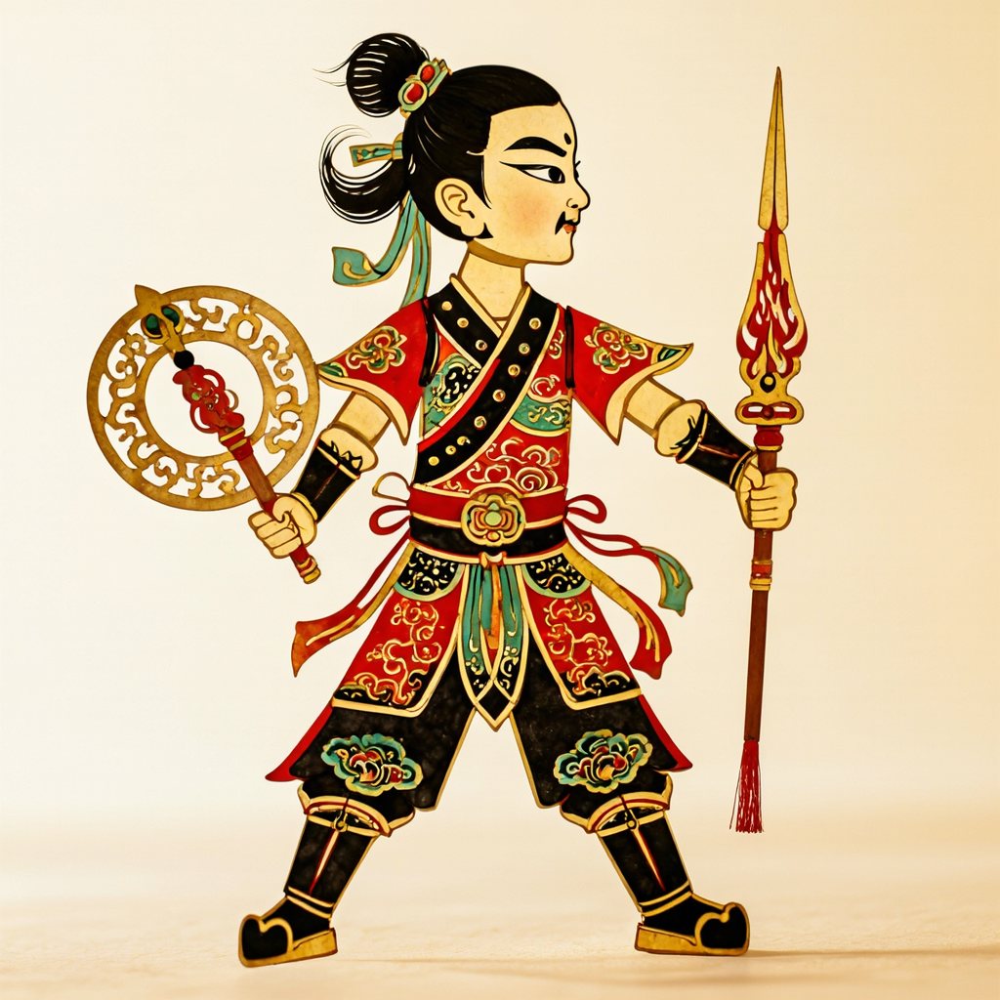

# LongCat LoRA API 断电恢复与项目接入报告

日期：2026-09-09（Asia/Shanghai）

## 1. 最终结论

- 服务器 API 只允许最终皮影 LoRA：`engine=diffusers-lora`、adapter scale `0.8`。
- 最终权重文件 `adapter_model.safetensors` 的 SHA-256 为
  `01add3926eeb1cda1bbe5fcc4c6a61f6502a38cb2411633934202243c0b6898c`。
- 模型、LoRA、隔离 Python 依赖、API 代码、私有配置、队列数据库和结果均位于持久盘
  `/home/ma-user/work`，服务器关闭后不会因容器重建而丢失。
- ModelArts 控制台仍需人工开机。实例开机后，仓库的一键连接脚本会自动恢复 API、等待模型
  就绪并建立 SSH 隧道，不要求组员手动登录后逐条启动。
- GitHub 项目的 `PROVIDER=ascend` 已从占位实现改为真实调用最终 LoRA：版本校验、提交任务、
  轮询、下载 PNG、登记资产均已实现。
- 生成接口现为真正的异步任务：`POST /api/textures/generate` 立即返回本地任务号，调用方通过
  `GET /api/tasks/{taskId}` 轮询，不再同步等待约 38 秒。
- 背景图会登记为“待审核场景图”；人物图登记为 `unrigged` 审核图。原始生成图不会被错误
  宣称成已经分件、可以直接驱动的角色包。

## 2. 为什么采用“开机后首次使用自动恢复”

本次只读核查确认：ModelArts 容器支持 `container_post_start` 机制，但本实例启动参数中没有配置
该钩子；`systemctl --user` 不可用，`ma-user` 的 cron 也被 PAM 禁止。仓库代码不能替代用户在
云控制台开机，也不能诚实承诺操作系统启动时自动运行后台服务。

因此采用与按需租用最匹配的恢复方式：服务器保持关机节省费用；需要使用时先在控制台开机，
随后执行一次本地连接脚本。脚本远程调用持久盘上的 `ensure_api.sh`，仅在 LoRA 完全就绪后才
建立隧道。

```bash
./scripts/connect-longcat-api.sh /绝对路径/KeyPair-2133.pem
```

恢复流程依次完成：

1. 加载当前 ModelArts 注入的 NPU 可见设备，不固化某次实例的物理卡号。
2. 验证基础模型目录、最终 LoRA 目录和私有配置仍在持久盘。
3. 读取 PID 文件后再检查 `/proc/{pid}/cmdline`，防止重启后的 PID 复用误杀其他进程。
4. 若服务完整且版本正确则直接复用；若只剩单个进程则安全替换；若未运行则启动。
5. 等待 `ready=true`、`engine=diffusers-lora` 和最终 adapter revision 同时成立。
6. 建立本地 `127.0.0.1:8010` 到服务器回环地址的隧道。

ModelArts 重建后 SSH 主机密钥可能变化。默认连接器使用 `/dev/null` 作为本次连接的
known-hosts 文件，以避免 OpenSSH 因旧指纹禁止端口转发。这与项目原有
`StrictHostKeyChecking=no` 的访问方式一致，但不提供主机指纹持久校验；若团队固定可信指纹，
应通过 `LONGCAT_SSH_KNOWN_HOSTS_FILE` 指向专用文件。

## 3. 项目后端调用链

`server/app/generation/ascend_provider.py` 的一次调用流程为：

1. 请求远端 `/health`。
2. 强制核验引擎为 `diffusers-lora`，适配器哈希为本轮最终哈希；其他引擎、旧 LoRA 或缺失
   版本号都会被拒绝。
3. 将用户的 `kind`、`prompt`、`negativePrompt`、`seed` 映射到远端队列，并固定已验证的
   50 steps、guidance 4.0、服务器风格模板开启。
4. 轮询远端任务到 `succeeded` 或 `failed`，默认最长 600 秒。
5. 下载 PNG，限制单图最大 32 MiB，并校验 PNG 文件头。
6. 背景写入 `assets/backgrounds/` 并原子更新 catalog；人物写入
   `assets/characters/{assetId}/source.png`、`preview.png` 和 `unrigged` manifest。

项目后端启动示例：

```bash
PROVIDER=ascend \
ASCEND_API_BASE_URL=http://127.0.0.1:8010 \
uvicorn server.app.main:app --port 8000
```

开发和课堂兜底仍可使用 `PROVIDER=cache`，服务器不可用时不会影响已审核的本地演示资源。

## 4. 最终实测提示词

调用方输入：

```text
江南水乡夜景，远景屋檐和拱桥，中央水面留出宽阔角色表演区
```

最终正向提示词：

```text
江南水乡夜景，远景屋檐和拱桥，中央水面留出宽阔角色表演区. piying_china_style, traditional Chinese shadow-puppet scenery backdrop only, flat planar non-photographic hand-cut paper and translucent leather composition, red gold black and muted teal palette, scenery restricted to the outer left edge, outer right edge and lower edge, the central 45 percent is continuous plain warm ivory paper without any boundary, object or shape, clear negative space for later character compositing, no central silhouette, no placeholder, no mask, no cutout hole, no theater stage, no proscenium, no curtain, no audience, no performer, no human figure, no text, flat 2D graphic shapes, strong warm backlight
```

最终负向提示词采用“调用方负面词 + 服务器完整模板”合并，不再让短负面词覆盖安全模板：

```text
现代建筑，人物，文字，水印, photorealistic, realistic person, stage photography, theater stage, proscenium, curtain, audience, performer, human figure, large central shape, blank silhouette, placeholder, mask, cutout hole, circular frame, photographic architecture, 3d render, glossy plastic, modern clothing, ordinary digital illustration, front view, front-facing pose, three-quarter view, symmetrical face, both eyes visible, cropped body, close-up, missing limb, extra limb, fused limbs, arms touching torso, overlapping legs, hidden hands, hidden feet, malformed anatomy, duplicate body, floating weapon, blurry edge, low contrast, busy background, central obstruction, text, letters, subtitle, logo, watermark, pseudo-text, 写实人物，舞台摄影，现代服饰，普通插画，正面，三分之四侧脸，对称正脸，双眼同时可见，主体裁切，缺肢，多肢，四肢粘连，手臂贴躯干，腿部重叠，手脚遮挡，复杂背景，中央被遮挡，文字，伪文字，水印
```

## 5. 同模型、同 seed 的工作流修正对比

固定参数：seed `2026090901`、1024×576、50 steps、guidance 4.0、LoRA scale 0.8。

### 5.1 修正前


问题：形成完整摄影式戏台，含五个人物，中央没有可供后续角色合成的留白。

### 5.2 第一轮修正


改善：人物和戏台主体消失。问题：模型把“中央完全留空”解释成巨大的金色占位轮廓。

### 5.3 最终模板


结果：巨大占位轮廓消失，中央成为连续宣纸留白，舞台摄影感显著下降。左侧建筑内仍有一个小型
人物/偶像，说明单张样例不能证明背景污染已彻底解决；因此 API 结果必须经过审核或失败重试，
当前不设置为自动替换课堂演示缓存。

最终任务：`54bdaefe9b294ee29d5b9546df165b6d`；生成时间 `38.51 s`；PNG 939,527 字节；
图片 SHA-256：`3cecf6916e574f7741dfc6d7df35519bbc307af444446f638b722002ed658843`。

## 6. 已完成验证

| 验证项 | 结果 |
|---|---|
| 服务器重建后持久盘保留模型、LoRA、API 配置 | 已验证 |
| 2026-09-09 再次开机后自动清理陈旧 PID 并恢复 API | 已验证 |
| 最终 LoRA 权重 SHA-256 与训练报告一致 | 已验证 |
| API 健康信息公开 adapter revision 与 scale | 已验证 |
| 完全停止 API 后由 `ensure_api.sh` 恢复 | 已验证 |
| 两个 PID 文件都伪造成 PID 1 时不误杀系统进程 | 已验证 |
| 一键脚本先恢复服务再建立本地 8010 隧道 | 已验证 |
| 本机经隧道读取最终 LoRA 健康状态 | 已验证 |
| GitHub provider 提交、轮询、下载、登记场景资产 | 已验证 |
| 同 seed 的三轮提示词工作流对比 | 已验证，仍保留人工审核 |
| Python 源码编译与 Shell 语法 | 已验证 |
| 仓库 schema/asset contract 检查 | 已验证 |

### 6.1 本次真实关机再开机复测

2026-09-09 服务器因按需租用关机，重新开机后没有 NPU 进程。同步 LoRA-only API 代码后，
`ensure_api.sh` 自动识别并丢弃断电遗留的 worker/API PID 文件，随后恢复服务。仓库
`scripts/connect-longcat-api.sh` 再次执行时识别到服务已经就绪，并成功建立本地 8010 隧道。

固定请求：哪吒少年武将，1024×1024、BF16、50 steps、guidance 4.0、seed `3407`、LoRA
scale `0.8`。提示词模板保持开启。

| 项目 | 开机后首次 | 同进程热态 |
|---|---:|---:|
| task ID | `e98a7edc66454e42a7a39f366d5df84f` | `d026e32bfa6344ccb0ebb9af64692325` |
| 模型加载 | `90.28 s` | 已常驻 |
| 单图生成 | `86.72 s` | `26.47 s` |
| 图片字节数 | 1,372,081 | 1,372,081 |
| 图片 SHA-256 | `2317d215…55aa9d` | `2317d215…55aa9d` |

两张图逐字节一致，证明断电恢复后的最终 LoRA、固定 seed 和提示词模板没有漂移。开机后首次
加载和首图明显受冷文件缓存、NPU 图编译影响，不能用来代表稳定态吞吐；课堂演示前应先执行
一次预热。证据：

- `evidence/longcat-lora-api-post-restart-cold-20260909.json`
- `evidence/longcat-lora-api-post-restart-warm-20260909.json`
- `evidence/longcat-lora-api-post-restart-seed3407-20260909.png`



## 7. 回滚方式

- 服务器更新前文件备份位于：
  `/home/ma-user/work/longcat_deploy/api_state_lora/deploy_backups/20260909-restart-safe-api/`。
- 2026-09-09 LoRA-only 收敛前的 6 个运行文件另存于：
  `/home/ma-user/work/longcat_deploy/backups/lora_only_before_20260909_1722/`。
- 服务端可先执行 `stop_api.sh`，恢复该目录中的对应文件，再执行 `start_api.sh`。
- 项目应用出现网络或模型问题时，将 `PROVIDER` 改为 `cache` 即可回到已审核的课堂演示资源。
- 本次没有覆盖模型权重、LoRA 权重、训练输出或既有正式生成结果。

## 8. 尚未自动化的边界

- 云实例开机本身仍需人工在控制台完成。
- 生成背景仍需中央留白、人物污染、文字污染和风格一致性审核。
- 生成角色仍需抠图、分件、关节点与 rig 标定；当前 API 只提供审核图。
- 当前项目本地任务状态保存在进程内，项目后端重启后本地任务号不持久化；远端 NPU 任务与
  结果由 SQLite 持久化。若后续需要多人长期并发，应再把项目任务队列迁移到持久数据库。
